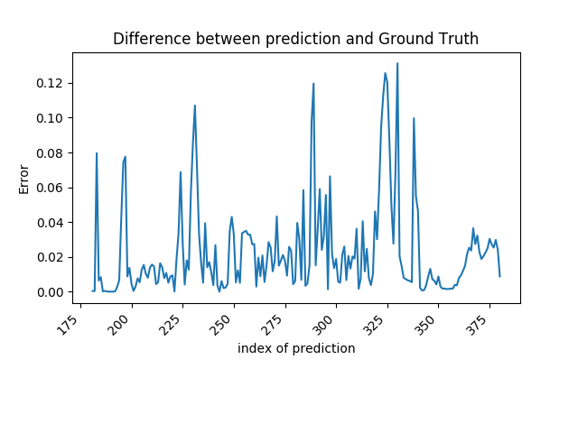
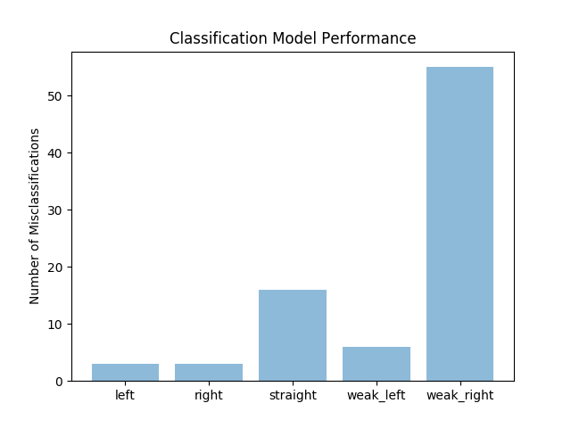

# Computer Vision 


**Photo Credit**: Hannah O'Leary, Oregon State University

Right now most things are limited to a single car. Multi-car experiments are a work in progress. 

## End to End Learning 

The current implementation is based on NVIDIA's DAVE-II Model.


**Data Collection:**

In three seperate terminals run the following:

 Terminal 1: 
 ```bash
 $ roslaunch race f1_tenth_devel.launch
 ```
 
 Terminal 2: 
 ```bash  
 $ rosrun computer_vision disparity_extender_vanderbilt.py
 ```
 
 Terminal 3: 
 
  ```bash  
 $ rosrun computer_vision synchronize_img_command.py
 ```
  
The synchronize_img_command performs the data collection. It collects the steering angles and logs the data into a directory which can be found in the data directory, categorized based on the degree of the turn. This categorization is used to train the classification model in the next section. The classes are left, right, weak_left, weak_right, straight. You can change the classes if you wish. Simply add more classes in the following [file](nodes/synchronize_img_command.py).

To access and view the data run: 
```bash
$ roscd computer_vision
```

I purposesly ignored the data directory for git tracking (It's very large). If you would like the data we used to train our models, I'm happy to provide it. Send me an email to obtain it.

**Training**

 You can tweak the hyperparameters in the following [file](training/train_daev_model.py).

```bash
$ roscd computer_vision/training 
$ python train_daev_model.py -d data/ -o models/{name_of_your_model}.hdf5
```

#### Evaluation

In two seperate terminals run the following:

To run an experiment where the model controls the car.

Terminal 1: 
```bash
$ roslaunch race f1_tenth_devel.launch
```
 
Terminal 2: 
```bash  
$ roscd computer_vision 
$ rosrun computer_vision ros_daev.py /racecar models/{name_of_your_model}.hdf5
```
To analyze the accuracy of your model. Instead of running the above in the second terminal. Run the following

Terminal 2: 
```bash  
$ roscd computer_vision/ 
$ rosrun computer_vision analyze_e2e.py /racecar models/{name_of_your_model}.hdf5 /vesc
```

Terminal 3: 
```bash  
$ rosrun race disparity_extender_vanderbilt.py
```
This will plot the error between the prediction from the neural network and ground truth (disparity extender).

You can also run the evaluation using the following launch. It assumes that your model is placed in the models directory within the [computer vision package](models). Simply specify your model name in the following [launch file](launch/end_to_end.launch) and run the following after launching f1_tenth_devel.launch:

```bash
  $ roslaunch computer_vision end_to_end.launch
```



## Classification Based Discrete Control

**Data Collection:** The data collection process is identical to the end-to-end scenario above. 

**Training**

You can select the architechture and hyperparameters in the following [file](training/train_classification_model.py). Simply add your architechture in the nn/conv directory appropriately.

Models that are currently available: 
- Mini VGGNET
- ShallowNet

To train a model run the following: 

```bash
$ roscd computer_vision/training 
$ python train_classification_model.py -d data/ -o models/{name_of_your_model}.hdf5
```

**Evalutation**

Similarly to the end-to-end driving scenario, there are two ways to evaluate the model. The first methods maps the classifications to discrete actions in order to control the car. The second method simply runs the classification model online and identifies misclassifications art runtime. Since the disparity extender was used to generate the training data, we can evaulate its performance with respect its operation. (Very open to suggestions on how to improve this)

To run Discrete Control experiments: 

Terminal 1: 
```bash
$ roslaunch race f1_tenth_devel.launch
```
 
Terminal 2: 
```bash  
$ roscd computer_vision 
$ rosrun computer_vision ros_classifier.py /racecar models/{name_of_your_model}.hdf5
```
The discrete control actions are defined in the following [file](nodes/ros_classifier.py). Feel free to tweak them for your experiments.

In a similar vein to the end-to-end learning experiments. You can analyze how well your classification system adheres to the ground truth classifications generated by either the disparity extender or the potential field controller.

To analyze the accuracy of your model. Instead of running the above in the second terminal. Run the following:

Terminal 2: 
```bash  
$ roscd computer_vision 
$ rosrun computer_vision analyze_classification_model.py /racecar models/{name_of_your_model}.hdf5 /vesc
```

Terminal 3: 
```bash  
$ rosrun race disparity_extender_vanderbilt.py
```

This will plot a box plot with the number of detections labeled as misclassifications.



To run the end-to-end simulation:

```bash
  roscd && cd ..
$ docker-compose -f end_to_end.yml up
```

To teleoperate the car or run experiments run the following:

```bash
$ docker container exec -it keyboard bash 
```

Then run: 
```bash 
$ source devel/setup.bash && rosrun race keyboard.py
```

To run the end-to-end simulation:

```bash
$ roscd && cd ..
$ docker-compose -f end_to_end.yml up
```

# End-to End Driving via Ensemble Based Classification 

The training process of neural networks is challenging and in some cases it can fail. This can mean that the model at the end of training may not be stable or the best-peforming set of weights. One way to deal with this challenge is to use ensemble methods which refers to training a "large number of modles and then combining their output predictions via voting or averaging. The other method of combining several methds is to use an average of the weights of multiple models to create a new model, this form of combining methods is called Polyak-Ruppert Averaging. A discussion of these techniques can be found in the following [tutorial](https://machinelearningmastery.com/polyak-neural-network-model-weight-ensemble/) by Dr. Jason Brownlee.

## Combining Predictions Using Averaging

The first method I investigate for evaluating ensemble methods on the F1Tenth platform is inspired by [Dr. Adrian Rosebrock](https://www.pyimagesearch.com/author/adrian/).

## Creating a new model using Polyak-Ruppert Averaging 

Working on this. Will be done by 4/10/2020.


